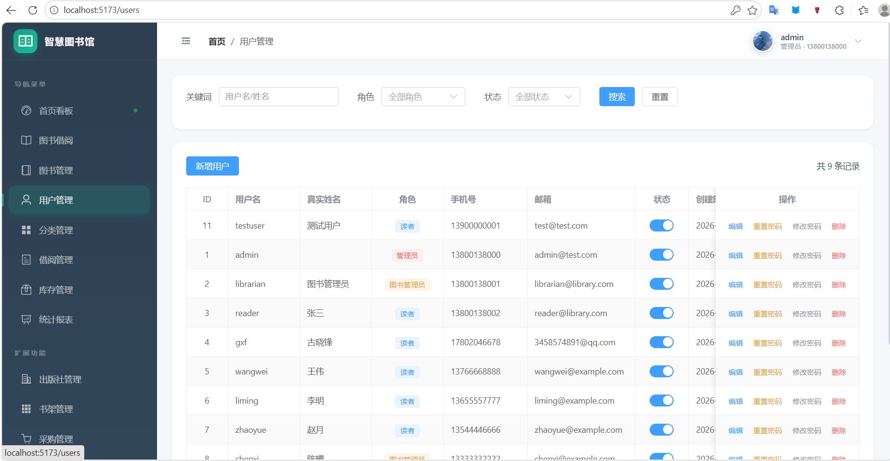
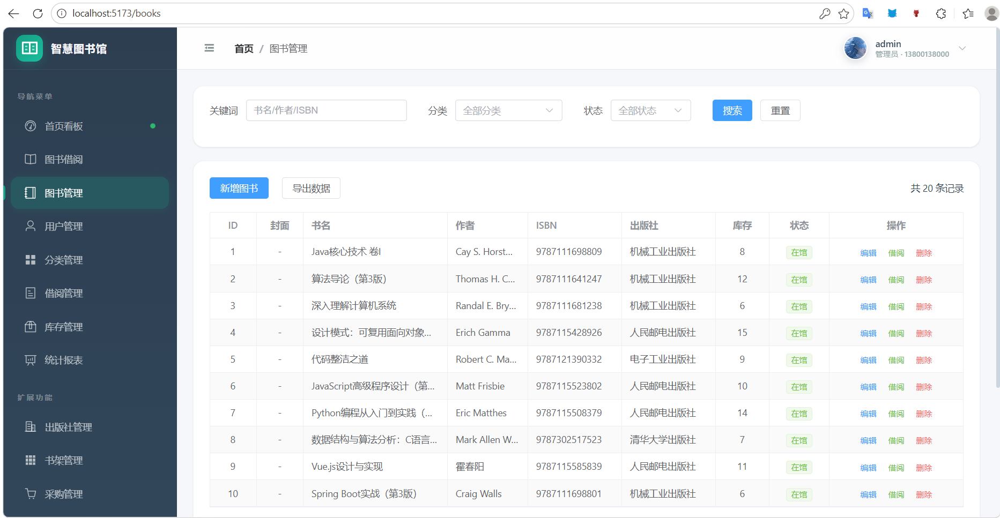
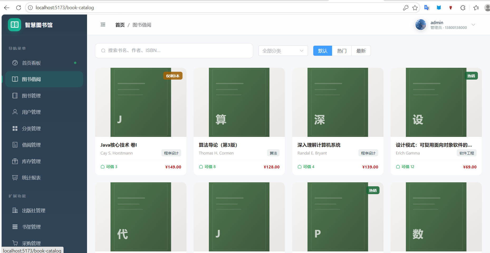
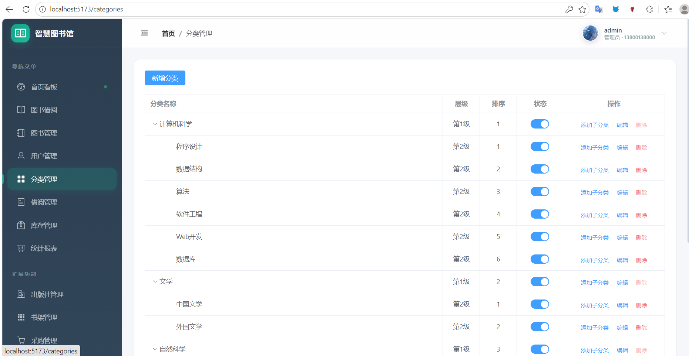
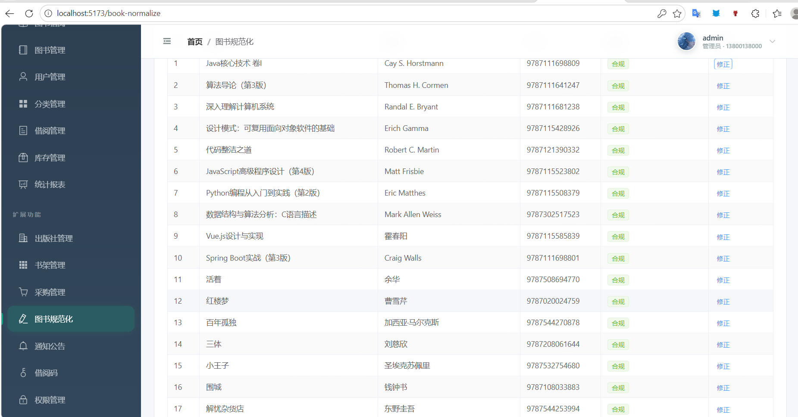
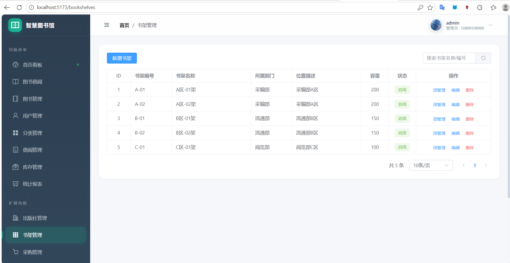
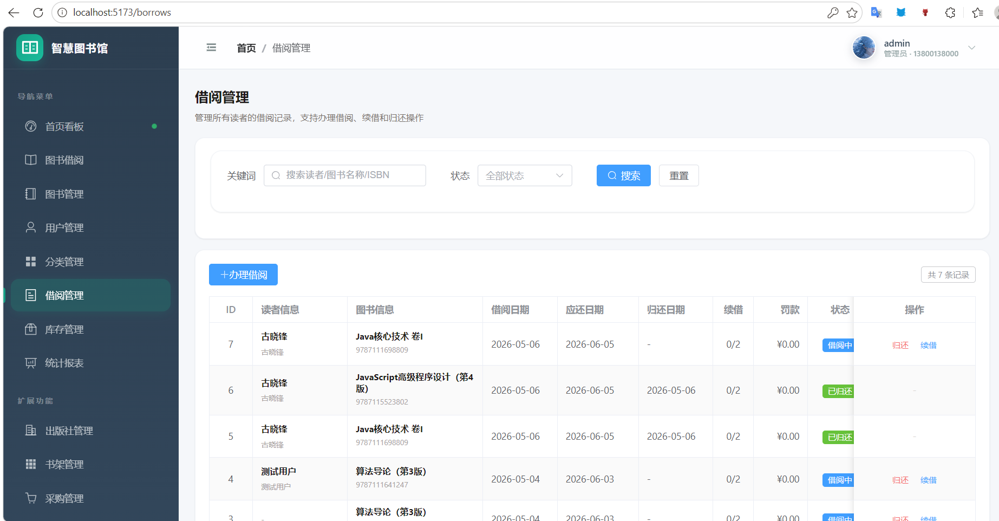
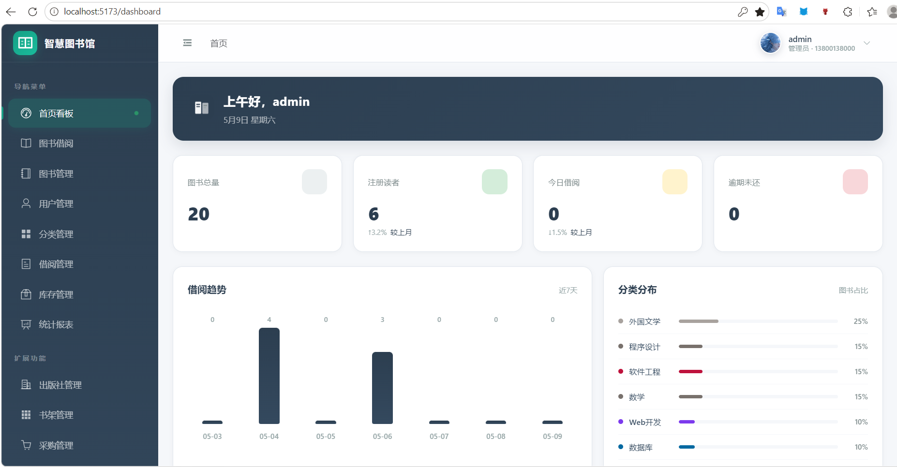
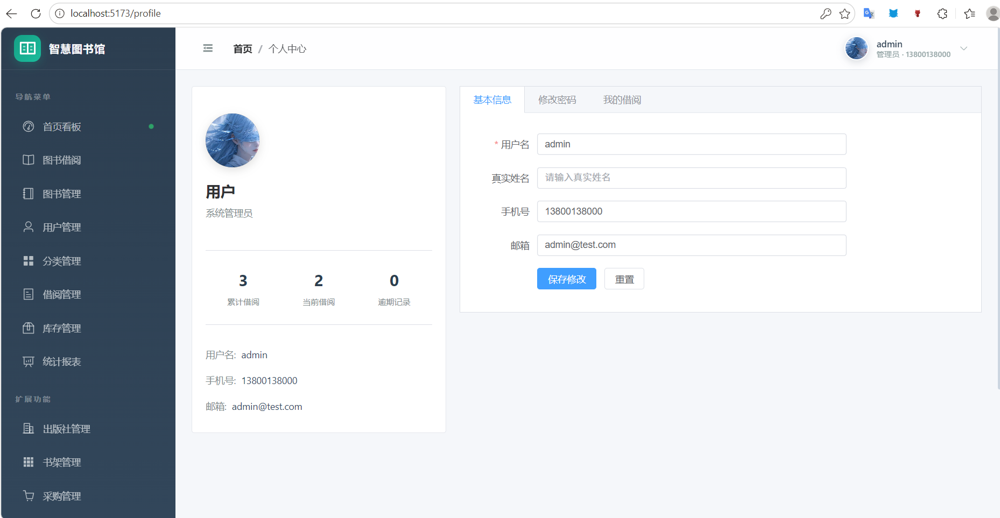
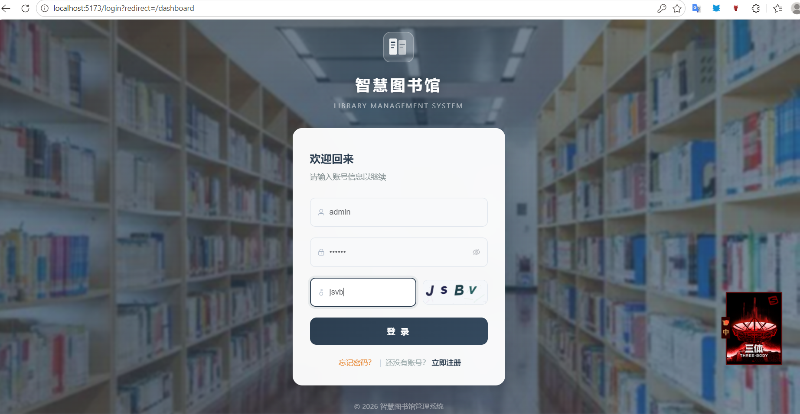

<h1 align="center">📚 智慧图书馆管理系统</h1>
<h3 align="center">Library Management System - 企业级图书管理全栈解决方案</h3>

<p align="center">
  
  
  
  
  
  
  
</p>

<p align="center">
  <a href="#项目简介">简介</a> •
  <a href="#功能特性">功能特性</a> •
  <a href="#系统演示">系统演示</a> •
  <a href="#技术架构">技术架构</a> •
  <a href="#快速开始">快速开始</a> •
  <a href="#项目结构">项目结构</a> •
  <a href="#API文档">API文档</a> •
  <a href="#安全机制">安全机制</a> •
  <a href="#贡献指南">贡献指南</a> •
  <a href="#许可证">许可证</a>
</p>

---

## 🌟 项目简介

**智慧图书馆管理系统（Smart Library Management System）** 是一套基于 **前后端分离架构** 开发的现代化、企业级图书管理平台。系统采用 **Spring Boot 3 + Vue 3 + TypeScript + MySQL** 全栈技术栈，专为高校图书馆、公共图书馆、企事业单位图书馆及社区图书室的数字化转型需求而设计。

### 为什么选择本系统？

| 特性 | 说明 |
|------|------|
| 🎯 **业务完整** | 覆盖图书采购→编目→借阅→归还→统计全流程 |
| 🔐 **安全可靠** | JWT + RBAC 双重认证，10+ 安全防护措施 |
| ⚡ **性能优异** | MyBatis-Plus 优化查询，Redis 缓存加速 |
| 🎨 **界面精美** | 现代化 UI 设计，响应式布局，流畅交互 |
| 📊 **数据驱动** | ECharts 可视化图表，实时数据大屏 |
| 🛠️ **易于部署** | Docker 一键启动，支持集群部署 |

---

## 📋 功能特性（详细版）

### 🔐 一、身份认证与安全管理

| 功能 | 详细说明 |
|------|----------|
| **用户登录** | 支持用户名/手机号登录，图形验证码防暴力破解 |
| **用户注册** | 新读者自助注册，支持实名认证信息填写 |
| **密码找回** | 通过邮箱/手机验证码重置密码 |
| **JWT Token** | 无状态 Token 认证，自动刷新过期 Token |
| **登录限流** | 同一 IP 5 分钟内最多尝试 10 次，超限锁定 |
| **多端登录** | 支持浏览器、移动端等多设备同时在线 |

### 👥 二、用户管理与权限控制

| 功能 | 详细说明 |
|------|----------|
| **角色体系** | 三级角色：超级管理员(ADMIN)、图书管理员(LIBRARIAN)、普通读者(READER) |
| **用户 CRUD** | 用户信息的增删改查，支持批量操作 |
| **状态管理** | 启用/禁用用户账号，离职人员一键停用 |
| **角色分配** | 灵活的角色切换与权限动态分配 |
| **密码重置** | 管理员可强制重置用户密码为默认值 |
| **个人信息** | 头像上传、真实姓名、手机号、邮箱修改 |
| **实名认证** | 读者实名信息审核，认证后解锁高级功能 |

<details>
<summary><b>👁️ 点击查看用户管理截图</b></summary>
<br>



*图：多角色用户管理界面，支持搜索筛选、批量操作、状态切换*

</details>

---

### 📚 三、图书管理模块

#### 3.1 图书基础管理

| 功能 | 详细说明 |
|------|----------|
| **图书录入** | 支持 ISBN 自动识别、手动录入两种方式 |
| **图书编辑** | 修改书名、作者、出版社、价格、库存等信息 |
| **图书删除** | 逻辑删除，保留历史记录，支持批量删除 |
| **图书详情** | 完整展示图书信息，含封面、分类、库存状态 |
| **库存管理** | 实时库存数量显示，在馆/借出/预约状态标识 |
| **高级搜索** | 支持按书名、作者、ISBN、分类、状态多条件组合检索 |
| **数据导出** | 支持将图书数据导出为 Excel 格式 |

<details>
<summary><b>👁️ 点击查看图书管理截图（列表视图）</b></summary>
<br>



*图：图书列表管理界面，支持分页、排序、多字段筛选*

</details>

<details>
<summary><b>👁️ 点击查看图书借阅截图（卡片视图）</b></summary>
<br>



*图：图书卡片式展示，直观显示封面、可借数量、价格，支持快捷借阅*

</details>

#### 3.2 分类管理体系

| 功能 | 详细说明 |
|------|----------|
| **多级分类** | 支持无限层级分类树（如：计算机科学→程序设计→Java） |
| **分类 CRUD** | 分类的增删改查，拖拽调整顺序 |
| **分类统计** | 实时统计每个分类下的图书数量和占比 |
| **分类图标** | 为分类设置颜色标签，便于视觉区分 |
| **热门分类** | Dashboard 展示 Top 热门分类排行 |

<details>
<summary><b>👁️ 点击查看分类管理截图</b></summary>
<br>



*图：树形分类管理界面，支持层级展开、排序、状态控制*

</details>

#### 3.3 出版社管理

| 功能 | 详细说明 |
|------|----------|
| **出版社库** | 维护出版社基本信息（名称、地址、联系方式） |
| **关联图书** | 快速查看某出版社的所有馆藏图书 |
| **出版社统计** | 各出版社图书数量排行分析 |

#### 3.4 图书规范化

| 功能 | 详细说明 |
|------|----------|
| **数据清洗** | 批量检测并修正图书数据中的不规范项（如 ISBN 格式、书名空格等） |
| **标准化处理** | 统一书名格式、作者姓名格式、ISBN 校验位修正 |
| **批量修正** | 一键对选中图书执行规范化操作 |
| **操作日志** | 记录每次规范化的变更内容，支持回滚 |

<details>
<summary><b>👁️ 点击查看图书规范化截图</b></summary>
<br>



*图：图书数据规范化界面，批量检测和修正不规范数据*

</details>

#### 3.5 书架管理

| 功能 | 详细说明 |
|------|----------|
| **书架配置** | 定义图书馆物理布局（区域→楼层→书架→层架） |
| **位置编码** | 为每本书分配唯一物理位置编码 |
| **容量管理** | 设置每个书架的容纳上限，超载预警 |
| **快速定位** | 通过位置编码快速找到图书所在位置 |

<details>
<summary><b>👁️ 点击查看书架管理截图</b></summary>
<br>



*图：书架信息管理界面，维护图书馆物理空间布局*

</details>

---

### 📖 四、借阅管理模块

#### 4.1 借阅流程

| 功能 | 详细说明 |
|------|----------|
| **图书借阅** | 读者通过借阅码或扫码借书，需输入验证码确认 |
| **图书归还** | 归还时自动计算是否逾期，生成罚款记录 |
| **续借操作** | 支持续借 1-2 次，每次延长借阅周期 |
| **借阅限制** | 单读者最大借阅数、单本书最长借阅天数限制 |
| **预约借阅** | 图书被借出时可预约，归还后优先通知 |

#### 4.2 借阅码系统

| 功能 | 详细说明 |
|------|----------|
| **生成借阅码** | 为每笔借阅生成唯一二维码/条形码 |
| **扫码借还** | 通过扫描枪或摄像头快速完成借还操作 |
| **借阅码打印** | 支持打印借阅小票，贴于图书封底 |

#### 4.3 我的借阅（读者视角）

| 功能 | 详细说明 |
|------|----------|
| **当前借阅** | 查看正在借阅中的图书，显示应还日期倒计时 |
| **历史记录** | 查看所有已完成的借阅/归还记录 |
| **逾期提醒** | 即将到期和已逾期的图书高亮提醒 |
| **罚款查看** | 查看因逾期产生的罚款金额和明细 |
| **一键续借** | 在允许次数内快速续借 |

<details>
<summary><b>👁️ 点击查看借阅管理截图</b></summary>
<br>



*图：借阅记录管理界面，管理员可查看和处理所有借阅事务*

</details>

#### 4.4 逾期与罚款

| 功能 | 详细说明 |
|------|----------|
| **自动检测** | 定时任务每日检查逾期图书，自动计算罚款 |
| **罚款规则** | 可配置逾期费率（元/天），支持阶梯计费 |
| **罚款缴纳** | 读者在线查看和确认罚款金额 |
| **豁免审批** | 管理员可对特殊情况进行罚款豁免 |

---

### 📊 五、数据统计与可视化

#### 5.1 数据仪表盘（Dashboard）

| 功能 | 详细说明 |
|------|----------|
| **核心指标卡** | 图书总量、注册读者、今日借阅、逾期未还 四大核心 KPI |
| **趋势对比** | 与上月数据的环比变化百分比 |
| **借阅趋势图** | 近 7 天/30 天借阅量柱状图，直观展示借阅波动 |
| **分类分布图** | 饼图/条形图展示各分类图书占比 |
| **热门图书榜** | Top 10 借阅量最高的图书排行榜 |
| **最近动态** | 最新 6 条借阅/归还操作流水 |

<details>
<summary><b>👁️ 点击查看数据仪表盘截图</b></summary>
<br>



*图：数据可视化仪表盘，包含 KPI 卡片、趋势图表、分类分布、热门排行*

</details>

#### 5.2 统计报表

| 报表类型 | 内容说明 |
|----------|----------|
| **借阅统计报表** | 按时间维度统计借阅量、归还量、续借量 |
| **读者活跃度报表** | 读者借阅频率排名、活跃/沉睡用户分析 |
| **图书流通率报表** | 各图书的流通次数、滞留图书预警 |
| **分类借阅分析** | 各分类图书的借阅热度对比 |
| **逾期分析报表** | 逾期率趋势、高频逾期用户名单 |

---

### 👤 六、个人中心

| 功能 | 详细说明 |
|------|----------|
| **头像设置** | 上传自定义头像，支持裁剪和预览 |
| **基本信息** | 查看/修改用户名、真实姓名、手机号、电子邮箱 |
| **密码修改** | 输入旧密码后设置新密码，强度校验 |
| **借阅概览** | 累计借阅数、当前在借数、逾期记录数一目了然 |
| **实名认证** | 填写真实身份信息，提交管理员审核 |

<details>
<summary><b>👁️ 点击查看个人中心截图</b></summary>
<br>



*图：个人中心界面，集成头像、信息编辑、借阅统计于一体*

</details>

---

### 🏢 七、扩展功能模块

| 模块 | 功能描述 |
|------|----------|
| **部门管理** | 组织架构管理，部门成员关联 |
| **采购管理** | 图书采购申请、审批流程、供应商管理、订单追踪 |
| **库存盘点** | 库存核对、差异报告、库存调整 |
| **公告通知** | 系统公告发布、消息推送、已读/未读标记 |
| **权限日志** | 操作审计日志、敏感操作记录追溯 |
| **出版社管理** | 出版社信息维护、图书关联统计 |

---

## 📸 系统演示（完整截图）

### 1️⃣ 登录页面

<p align="center">
  
</p>
<p align="center">现代化登录界面 · 图形验证码安全防护 · 响应式背景设计</p>

---

### 2️⃣ 数据仪表盘

<p align="center">
  
</p>
<p align="center">四大核心 KPI · 近7天借阅趋势 · 分类分布占比 · 热门图书排行</p>

---

### 3️⃣ 图书管理（列表视图）

<p align="center">
  
</p>
<p align="center">完整图书 CRUD · 多条件高级搜索 · 批量操作 · 状态标签</p>

---

### 4️⃣ 图书借阅（卡片视图）

<p align="center">
  
</p>
<p align="center">卡片式图书展示 · 封面预览 · 可借数量 · 价格信息 · 快捷借阅</p>

---

### 5️⃣ 个人中心

<p align="center">
  
</p>
<p align="center">头像上传 · 信息编辑 · 借阅统计 · 密码修改</p>

---

### 6️⃣ 用户管理

<p align="center">
  
</p>
<p align="center">多角色管理 · 权限分配 · 状态控制 · 密码重置</p>

---

### 7️⃣ 分类管理

<p align="center">
  
</p>
<p align="center">树形分类体系 · 层级展开 · 排序权重 · 子分类统计</p>

---

### 8️⃣ 借阅管理

<p align="center">
  
</p>
<p align="center">借阅记录全景 · 逾期标识 · 罚款金额 · 还书/续借操作</p>

---

### 9️⃣ 书架管理

<p align="center">
  
</p>
<p align="center">物理空间建模 · 区域-楼层-书架 · 容量配置 · 位置编码</p>

---

### 🔟 图书规范化

<p align="center">
  
</p>
<p align="center">数据质量检测 · ISBN 校验 · 格式标准化 · 批量修正</p>

---

## 🏗️ 技术架构

```
┌─────────────────────────────────────────────────────────────────┐
│                        表现层 Presentation                       │
│   ┌─────────────┐  ┌─────────────┐  ┌─────────────┐            │
│   │  Vue 3.4+   │  │ Element Plus│  │  ECharts 5  │            │
│   │  TypeScript │  │   UI 组件库  │  │  数据可视化  │            │
│   └─────────────┘  └─────────────┘  └─────────────┘            │
├─────────────────────────────────────────────────────────────────┤
│                        前端框架 Frontend                          │
│   ┌─────────────┐  ┌─────────────┐  ┌─────────────┐            │
│   │  Vite 5.x   │  │ Vue Router 4│  │   Pinia 2   │            │
│   │   构建工具   │  │   路由管理   │  │  状态管理    │            │
│   └─────────────┘  └─────────────┘  └─────────────┘            │
├─────────────────────────────────────────────────────────────────┤
│                        后端框架 Backend                           │
│   ┌─────────────┐  ┌─────────────┐  ┌─────────────┐            │
│   │ Spring Boot │  │ Spring Sec  │  │MyBatis-Plus │            │
│   │    3.2.x    │  │   urity 6   │  │   3.5.x     │            │
│   └─────────────┘  └─────────────┘  └─────────────┘            │
├─────────────────────────────────────────────────────────────────┤
│                        数据存储 Data                             │
│   ┌─────────────┐  ┌─────────────┐  ┌─────────────┐            │
│   │   MySQL 8   │  │  Redis 缓存  │  │  本地文件    │            │
│   │  关系数据库  │  │  会话/热点   │  │  头像/封面   │            │
│   └─────────────┘  └─────────────┘  └─────────────┘            │
└─────────────────────────────────────────────────────────────────┘
```

### 技术栈一览

| 层次 | 技术 | 版本 | 用途说明 |
|:----:|------|:----:|----------|
| **前端语言** | TypeScript | 5.x | 类型安全的 JavaScript 超集 |
| **前端框架** | Vue.js | 3.4+ | 渐进式 JavaScript 框架 |
| **构建工具** | Vite | 5.x | 极速开发服务器和构建工具 |
| **UI 组件库** | Element Plus | 2.x | 基于 Vue 3 的企业级组件库 |
| **路由管理** | Vue Router | 4.x | SPA 路由守卫与懒加载 |
| **状态管理** | Pinia | 2.x | 轻量级状态管理替代 Vuex |
| **HTTP 客户端** | Axios | 1.x | 请求拦截器与统一错误处理 |
| **图表库** | Apache ECharts | 5.x | 数据可视化图表渲染 |
| **CSS 预处理** | SCSS/Sass | - | 模块化样式编写 |
| **后端语言** | Java | 17 LTS | 编程语言（长期支持版本） |
| **应用框架** | Spring Boot | 3.2.x | 企业级应用开发框架 |
| **安全框架** | Spring Security | 6.x | 认证授权与安全防护 |
| **ORM 框架** | MyBatis-Plus | 3.5.x | MyBatis 增强工具包 |
| **数据库** | MySQL | 8.0+ | 主数据存储 |
| **Token 认证** | JJWT | 0.12.x | JSON Web Token 生成与解析 |
| **API 文档** | Swagger/OpenAPI | 2.x | 在线接口文档与测试 |
| **代码简化** | Lombok | 1.18.x | 注解驱动的样板代码消除 |
| **容器化** | Docker | 20.x | 应用容器化部署 |
| **反向代理** | Nginx | 1.24+ | 高性能 HTTP 服务器 |

---

## 🚀 快速开始

### 系统要求

| 环境 | 最低要求 | 推荐配置 |
|------|----------|----------|
| JDK | 17 LTS | 17 或 21 LTS |
| Node.js | >= 18.0 | >= 20.0 LTS |
| MySQL | >= 8.0 | >= 8.0.30 |
| Maven | >= 3.8 | >= 3.9 |
| pnpm | >= 8.0 | >= 9.0 |
| 内存 | 4 GB RAM | 8 GB RAM |
| 磁盘 | 2 GB 可用 | SSD 推荐 |

### 第一步：克隆仓库

```bash
git clone https://github.com/gxfdev/library-management-system.git
cd library-management-system
```

### 第二步：后端配置与启动

```bash
# 进入后端目录
cd backend

# 复制环境变量模板
cp .env.example .env

# 编辑 .env 文件（必须修改以下配置）
# ========================================
# SPRING_DATASOURCE_URL=jdbc:mysql://localhost:3306/library_db?useSSL=false&serverTimezone=Asia/Shanghai&characterEncoding=utf-8
# SPRING_DATASOURCE_USERNAME=root
# SPRING_DATASOURCE_PASSWORD=你的MySQL密码
# JWT_SECRET=请生成一个至少32位的随机字符串作为JWT密钥
# ========================================

# 创建数据库并导入初始化脚本
mysql -u root -p -e "CREATE DATABASE IF NOT EXISTS library_db DEFAULT CHARACTER SET utf8mb4 COLLATE utf8mb4_unicode_ci;"
mysql -u root -p library_db < sql/init.sql

# 如有升级脚本，执行迁移
mysql -u root -p library_db < sql/migration_v2.sql

# 启动后端服务（首次运行会下载依赖，约需 2-5 分钟）
mvn clean spring-boot:run
```

✅ 后端启动成功标志：
```
Started LibraryApplication in x.xxx seconds
```
访问地址：`http://localhost:8080`

### 第三步：前端配置与启动

```bash
# 打开新终端，进入前端目录
cd frontend

# 安装依赖（首次约需 1-3 分钟）
pnpm install

# 启动开发服务器
pnpm dev
```

✅ 前端启动成功标志：
```
VITE v5.x ready in xxx ms
➜  Local:   http://localhost:5173/
```

### 第四步：访问系统

打开浏览器访问：**http://localhost:5173**

#### 默认测试账号

| 角色 | 用户名 | 密码 | 权限范围 |
|:----:|--------|:----:|----------|
| 🦸 超级管理员 | `admin` | `admin123` | 全部功能 |
| 📚 图书管理员 | `librarian` | `librarian123` | 图书/借阅/库存/统计 |
| 👤 普通读者 | `reader` | `reader123` | 借阅/个人中心 |

### 🐳 Docker 一键部署（推荐生产环境）

```bash
# 确保已安装 Docker 和 Docker Compose

# 1. 配置环境变量
cp backend/.env.example backend/.env
# 编辑 backend/.env 填入实际配置

# 2. 一键启动全部服务
docker-compose up -d --build

# 3. 查看服务状态
docker-compose ps

# 4. 查看日志
docker-compose logs -f
```

Docker Compose 启动的服务：

| 服务 | 端口 | 说明 |
|:----:|:----:|------|
| Frontend (Nginx) | 80 | 前端静态资源 + 反向代理 |
| Backend (Spring Boot) | 8080 | 后端 API 服务 |
| MySQL | 3306 | 数据库 |
| Redis | 6379 | 缓存服务 |

---

## 📁 项目结构

```
library-management-system/
│
├── 📂 backend/                          # 后端项目 (Spring Boot)
│   ├── 📂 src/main/java/com/library/
│   │   ├── 📄 LibraryApplication.java   # 应用启动入口
│   │   │
│   │   ├── 📂 common/                  # 公共模块
│   │   │   ├── Result.java             # 统一响应结果封装
│   │   │   └── PageResult.java         # 分页结果封装
│   │   │
│   │   ├── 📂 config/                  # 配置模块
│   │   │   ├── SecurityConfig.java     # Spring Security 安全配置
│   │   │   ├── CorsConfig.java         # 跨域资源共享配置
│   │   │   ├── SwaggerConfig.java      # Swagger API 文档配置
│   │   │   ├── XssSqlFilter.java       # XSS/SQL 注入过滤
│   │   │   ├── WebMvcConfig.java       # Web MVC 配置
│   │   │   └── MyBatisPlusConfig.java  # MyBatis-Plus 配置
│   │   │
│   │   ├── 📂 controller/              # 控制器层 (RESTful API)
│   │   │   ├── AuthController.java     # 认证接口
│   │   │   ├── UserController.java     # 用户管理接口
│   │   │   ├── BookController.java     # 图书管理接口
│   │   │   ├── BookCategoryController.java  # 分类管理接口
│   │   │   ├── BorrowRecordController.java  # 借阅管理接口
│   │   │   ├── CaptchaController.java  # 验证码接口
│   │   │   ├── StatisticsController.java    # 统计接口
│   │   │   ├── ProfileController.java  # 个人中心接口
│   │   │   ├── FileUploadController.java    # 文件上传接口
│   │   │   └── ...                     # 其他控制器
│   │   │
│   │   ├── 📂 dto/                     # 数据传输对象
│   │   │   ├── LoginRequest.java       # 登录请求 DTO
│   │   │   ├── LoginResponse.java      # 登录响应 DTO
│   │   │   ├── RegisterRequest.java    # 注册请求 DTO
│   │   │   ├── BookRequest.java        # 图书请求 DTO
│   │   │   ├── BorrowRequest.java      # 借阅请求 DTO
│   │   │   └── ...                     # 其他 DTO
│   │   │
│   │   ├── 📂 entity/                  # 数据实体类
│   │   │   ├── User.java               # 用户实体
│   │   │   ├── Book.java               # 图书实体
│   │   │   ├── BorrowRecord.java       # 借阅记录实体
│   │   │   ├── BookCategory.java       # 分类实体
│   │   │   └── ...                     # 其他实体
│   │   │
│   │   ├── 📂 mapper/                  # MyBatis Mapper 接口
│   │   │   ├── UserMapper.java
│   │   │   ├── BookMapper.java
│   │   │   └── ...
│   │   │
│   │   ├── 📂 service/                 # 业务逻辑层
│   │   │   ├── UserService.java        # 用户服务接口
│   │   │   ├── impl/
│   │   │   │   └── UserServiceImpl.java  # 用户服务实现
│   │   │   ├── BookService.java
│   │   │   ├── BorrowRecordService.java
│   │   │   └── ...
│   │   │
│   │   ├── 📂 security/                # 安全模块
│   │   │   ├── JwtTokenProvider.java   # JWT 工具类
│   │   │   ├── JwtAuthenticationFilter.java  # JWT 过滤器
│   │   │   ├── JwtAuthenticationEntryPoint.java  # 认证入口
│   │   │   └── JwtAccessDeniedHandler.java      # 权限拒绝处理器
│   │   │
│   │   ├── 📂 exception/               # 异常处理
│   │   │   └── GlobalExceptionHandler.java  # 全局异常处理器
│   │   │
│   │   └── 📂 task/                    # 定时任务
│   │       └── OverdueCheckTask.java  # 逾期检查定时任务
│   │
│   ├── 📂 src/main/resources/
│   │   ├── application.yml             # 主配置文件
│   │   ├── application-dev.yml         # 开发环境配置
│   │   ├── application-prod.yml        # 生产环境配置
│   │   ├── logback-spring.xml          # 日志配置
│   │   └── 📂 mapper/                  # MyBatis XML 映射文件
│   │       ├── UserMapper.xml
│   │       ├── BookMapper.xml
│   │       └── BorrowRecordMapper.xml
│   │
│   ├── 📂 sql/                         # 数据库脚本
│   │   ├── init.sql                    # 初始化建表和数据
│   │   └── migration_v2.sql            # 升级迁移脚本
│   │
│   ├── 📂 uploads/                     # 上传文件存储目录
│   │   └── avatars/                    # 用户头像
│   │
│   ├── 📄 pom.xml                      # Maven 项目配置
│   ├── 📄 Dockerfile                   # Docker 构建文件
│   ├── 📄 docker-compose.yml           # Docker 编排文件
│   ├── 📄 nginx.conf                   # Nginx 配置
│   └── 📄 .env.example                 # 环境变量模板
│
├── 📂 frontend/                         # 前端项目 (Vue 3 + TS)
│   ├── 📂 src/
│   │   ├── 📄 main.ts                  # 应用入口
│   │   ├── 📄 App.vue                  # 根组件
│   │   │
│   │   ├── 📂 api/                     # API 接口定义
│   │   │   ├── request.ts              # Axios 实例与拦截器
│   │   │   ├── auth.ts                 # 认证相关 API
│   │   │   ├── user.ts                 # 用户相关 API
│   │   │   ├── book.ts                 # 图书相关 API
│   │   │   ├── borrow.ts               # 借阅相关 API
│   │   │   ├── category.ts             # 分类相关 API
│   │   │   ├── dashboard.ts            # 仪表盘相关 API
│   │   │   ├── profile.ts              # 个人中心 API
│   │   │   └── ...                     # 其他 API 模块
│   │   │
│   │   ├── 📂 assets/                  # 静态资源
│   │   │   ├── images/                 # 图片资源
│   │   │   │   └── library-bg.jpg      # 登录页背景
│   │   │   └── styles/                 # 全局样式
│   │   │       └── global.scss         # 全局 SCSS 变量和混入
│   │   │
│   │   ├── 📂 components/              # 公共组件
│   │   │   └── Layout/
│   │   │       └── index.vue           # 主布局组件（侧边栏+顶栏）
│   │   │
│   │   ├── 📂 router/                  # 路由配置
│   │   │   └── index.ts                # 路由定义与导航守卫
│   │   │
│   │   ├── 📂 store/                   # Pinia 状态管理
│   │   │   └── modules/
│   │   │       └── user.ts             # 用户状态模块
│   │   │
│   │   ├── 📂 types/                   # TypeScript 类型定义
│   │   │   └── index.ts                # 全局类型声明
│   │   │
│   │   └── 📂 views/                   # 页面组件
│   │       ├── 📂 login/               # 登录页面
│   │       │   └── index.vue
│   │       ├── 📂 dashboard/           # 数据仪表盘
│   │       │   └── index.vue
│   │       ├── 📂 book/                # 图书管理
│   │       │   ├── index.vue           # 图书列表
│   │       │   └── components/
│   │       │       └── BookDialog.vue  # 图书编辑弹窗
│   │       ├── 📂 book-catalog/        # 图书目录（读者视角）
│   │       │   ├── index.vue           # 图书卡片列表
│   │       │   └── components/
│   │       │       └── BookDetailDialog.vue  # 图书详情弹窗
│   │       ├── 📂 book-normalize/      # 图书规范化
│   │       │   └── index.vue
│   │       ├── 📂 borrow/              # 借阅管理
│   │       │   ├── index.vue           # 借阅列表（管理员）
│   │       │   ├── my-borrows.vue      # 我的借阅（读者）
│   │       │   ├── code.vue            # 借阅码
│   │       │   └── components/
│   │       │       └── BorrowDialog.vue  # 借阅弹窗
│   │       ├── 📂 category/            # 分类管理
│   │       │   ├── index.vue
│   │       │   └── components/
│   │       │       └── CategoryDialog.vue
│   │       ├── 📂 user/                # 用户管理
│   │       │   ├── index.vue
│   │       │   └── components/
│   │       │       └── UserDialog.vue
│   │       ├── 📂 profile/             # 个人中心
│   │       │   └── index.vue
│   │       ├── 📂 bookshelf/           # 书架管理
│   │       ├── 📂 inventory/           # 库存管理
│   │       ├── 📂 statistics/          # 统计报表
│   │       ├── 📂 publisher/           # 出版社管理
│   │       ├── 📂 purchase/            # 采购管理
│   │       ├── 📂 notice/              # 公告通知
│   │       ├── 📂 permission/          # 权限日志
│   │       └── 📂 error/               # 错误页面
│   │           ├── 403.vue
│   │           └── 404.vue
│   │
│   ├── 📄 index.html                   # HTML 入口模板
│   ├── 📄 package.json                 # npm 依赖配置
│   ├── 📄 pnpm-lock.yaml               # pnpm 锁定文件
│   ├── 📄 vite.config.ts               # Vite 构建配置
│   ├── 📄 tsconfig.json                # TypeScript 配置
│   └── 📄 tsconfig.node.json           # Node.js TS 配置
│
├── 📂 docs/                            # 项目文档
│   └── 📂 images/                      # 文档截图
│       ├── login.png                   # 登录页面
│       ├── dashboard.png               # 数据仪表盘
│       ├── book-management.png         # 图书管理
│       ├── book-catalog.png            # 图书借阅(卡片)
│       ├── profile.png                 # 个人中心
│       ├── user-management.png         # 用户管理
│       ├── categories.png              # 分类管理
│       ├── borrows.png                 # 借阅管理
│       ├── bookshelves.png             # 书架管理
│       └── book-normalize.png          # 图书规范化
│
├── 📄 docker-compose.yml               # Docker 编排配置
├── 📄 nginx.conf                       # Nginx 反向代理配置
├── 📄 .gitignore                       # Git 忽略规则
├── 📄 LICENSE                          # MIT 开源许可证
└── 📄 README.md                        # 项目说明文档（本文件）
```

---

## 📡 API 文档

系统集成了 **Swagger/OpenAPI 3.0** 在线文档，启动后端服务后访问：

```
http://localhost:8080/swagger-ui.html
```

### API 模块总览

| 模块 | 前缀路径 | 接口数量 | 说明 |
|:----:|---------|:-------:|------|
| 🔑 身份认证 | `/api/auth` | 6 | 登录、注册、Token刷新、密码重置 |
| 👤 用户管理 | `/api/users` | 8 | 用户CRUD、角色分配、状态控制 |
| 📚 图书管理 | `/api/books` | 10 | 图书增删改查、搜索、导出 |
| 📖 图书借阅 | `/api/book-catalog` | 5 | 读者视角图书浏览、详情 |
| 🏷️ 分类管理 | `/api/categories` | 6 | 分类树CRUD、排序、统计 |
| 📋 借阅管理 | `/api/borrows` | 8 | 借书、还书、续借、记录查询 |
| 📊 数据统计 | `/api/statistics` | 5 | 各类统计数据接口 |
| 👤 个人中心 | `/api/profile` | 5 | 信息修改、头像上传、密码更改 |
| 📁 文件上传 | `/api/uploads` | 2 | 头像、图片上传 |
| 🔢 验证码 | `/api/captcha` | 2 | 图形验证码生成与校验 |
| 📢 公告通知 | `/api/notices` | 5 | 公告发布与管理 |
| 🏢 部门管理 | `/api/depts` | 5 | 组织架构管理 |
| 📦 采购管理 | `/api/purchases` | 8 | 采购申请与订单管理 |
| 📚 出版社 | `/api/publishers` | 5 | 出版社信息管理 |
| 🗄️ 书架管理 | `/api/bookshelves` | 6 | 物理书架配置 |
| ✅ 图书规范化 | `/api/book-normalize` | 4 | 数据质量检测与修正 |
| 📝 借阅码 | `/api/borrow-code` | 3 | 借阅码生成与管理 |
| 🔒 权限日志 | `/api/permissions` | 4 | 操作审计日志 |

---

## 🔒 安全机制

本系统采用多层次安全防护体系：

### 认证与授权

| 安全措施 | 实现方式 | 说明 |
|----------|----------|------|
| **JWT Token 认证** | jjwt 0.12.x | 无状态 Token，包含用户ID、角色、过期时间 |
| **RBAC 角色权限** | @PreAuthorize 注解 | 接口级别的细粒度权限控制 |
| **密码加密存储** | BCrypt | 单向哈希，不可逆，加盐处理 |
| **图形验证码** | 自研 CaptchaController | 登录时强制校验，防暴力破解 |
| **登录频率限制** | LoginRateLimitFilter | 同IP 5分钟内最多10次失败尝试 |

### 输入与输出安全

| 安全措施 | 实现方式 | 说明 |
|----------|----------|------|
| **XSS 防护** | XssSqlFilter | 输入参数过滤特殊字符，输出转义 |
| **SQL 注入防护** | MyBatis 参数化查询 | 所有 SQL 使用 #{ } 占位符 |
| **CORS 配置** | CorsConfig | 仅允许信任来源的跨域请求 |
| **CSRF 防护** | SameSite Cookie | Cookie 设置 SameSite 属性 |

### 响应头安全

| 安全头 | 值 | 作用 |
|--------|-----|------|
| X-Content-Type-Options | nosniff | 禁止 MIME 类型嗅探 |
| X-Frame-Options | DENY | 防止点击劫持 |
| X-XSS-Protection | 0 | 浏览器 XSS 过滤器 |
| Content-Security-Policy | strict | 限制资源加载来源 |
| Referrer-Policy | strict-origin | 控制 Referer 信息泄露 |
| Permissions-Policy | camera=(), microphone=() | 禁用敏感设备权限 |

---

## 🤝 贡献指南

我们非常欢迎社区贡献！无论是 Bug 修复、新功能开发还是文档改进。

### 如何参与贡献

```bash
# 1. Fork 本仓库到你的 GitHub 账号
# 2. 克隆你的 Fork
git clone https://github.com/<your-username>/library-management-system.git
cd library-management-system

# 3. 创建功能分支
git checkout -b feature/amazing-feature

# 4. 进行开发和测试
# 5. 提交你的更改
git commit -m 'feat: add amazing feature'

# 6. 推送到你的 Fork
git push origin feature/amazing-feature

# 7. 在 GitHub 上创建 Pull Request
```

### 提交规范

我们使用 [Conventional Commits](https://www.conventionalcommits.org/) 规范：

| 类型 | 说明 |
|------|------|
| `feat:` | 新功能 |
| `fix:` | Bug 修复 |
| `docs:` | 文档更新 |
| `style:` | 代码格式（不影响功能） |
| `refactor:` | 重构（非新功能、非修复） |
| `perf:` | 性能优化 |
| `test:` | 测试相关 |
| `chore:` | 构建/工具链变更 |

### 代码规范

- **后端**：遵循 [阿里巴巴 Java 开发手册](https://github.com/alibaba/p3c)
- **前端**：遵循 [Vue 3 风格指南](https://vuejs.org/style-guide/)
- **命名**：使用语义化的变量和函数名
- **注释**：关键业务逻辑添加中文注释

---

## 📊 项目路线图

### ✅ 已完成 (v1.0)

- [x] 用户认证与权限系统
- [x] 图书基础管理（CRUD、搜索、分类）
- [x] 借阅归还完整流程
- [x] 图形验证码安全机制
- [x] 数据可视化仪表盘
- [x] 个人中心与头像上传
- [x] 用户管理后台
- [x] 分类/出版社/书架管理
- [x] 图书数据规范化
- [x] XSS/SQL注入安全防护

### 🚧 开发中 (v1.1)

- [ ] 移动端响应式适配优化
- [ ] Excel/PDF 数据导出功能
- [ ] 高级统计报表生成器
- [ ] 操作日志审计增强

### 📋 规划中 (v2.0+)

- [ ] 微信小程序 / 移动 App
- [ ] 图书智能推荐算法（协同过滤）
- [ ] 多语言国际化 (i18n)
- [ ] 消息通知系统（邮件/短信/站内信）
- [ ] RFID/条形码硬件集成
- [ ] 大屏数据可视化驾驶舱
- [ ] 微服务架构改造
- [ ] Kubernetes 集群部署方案

---

## 🙏 致谢

感谢以下优秀的开源项目为本系统提供了坚实的技术基础：

| 项目 | 许可证 | 用途 |
|------|:------:|------|
| [Spring](https://spring.io/projects/spring-boot) | Apache 2.0 | 后端核心框架 |
| [Vue.js](https://vuejs.org/) | MIT | 前端渐进式框架 |
| [Element Plus](https://element-plus.org/) | MIT | UI 组件库 |
| [MyBatis-Plus](https://baomidou.com/) | Apache 2.0 | ORM 增强工具 |
| [Apache ECharts](https://echarts.apache.org/) | Apache 2.0 | 数据可视化图表 |
| [Axios](https://axios-http.com/) | MIT | HTTP 客户端 |
| [Lombok](https://projectlombok.org/) | BSD-3 | Java 代码简化 |
| [Swagger](https://swagger.io/) | Apache 2.0 | API 文档生成 |

---

## 📄 许可证

本项目基于 [MIT License](LICENSE) 开源协议发布。

```
MIT License

Copyright (c) 2026 gxfdev

Permission is hereby granted, free of charge, to any person obtaining a copy
of this software and associated documentation files (the "Software"), to deal
in the Software without restriction, including without limitation the rights
to use, copy, modify, merge, publish, distribute, sublicense, and/or sell
copies of the Software, and to permit persons to whom the Software is
furnished to do so, subject to the following conditions:

The above copyright notice and this permission notice shall be included in all
copies or substantial portions of the Software.

THE SOFTWARE IS PROVIDED "AS IS", WITHOUT WARRANTY OF ANY KIND, EXPRESS OR
IMPLIED, INCLUDING BUT NOT LIMITED TO THE WARRANTIES OF MERCHANTABILITY,
FITNESS FOR A PARTICULAR PURPOSE AND NONINFRINGEMENT. IN NO EVENT SHALL THE
AUTHORS OR COPYRIGHT HOLDERS BE LIABLE FOR ANY CLAIM, DAMAGES OR OTHER
LIABILITY, WHETHER IN AN ACTION OF CONTRACT, TORT OR OTHERWISE, ARISING FROM,
OUT OF OR IN CONNECTION WITH THE SOFTWARE OR THE USE OR OTHER DEALINGS IN THE
SOFTWARE.
```

---

## 📮 联系我们

| 方式 | 信息 |
|:----:|------|
| **作者** | gxfdev |
| **GitHub** | [https://github.com/gxfdev](https://github.com/gxfdev) |
| **项目主页** | [https://github.com/gxfdev/library-management-system](https://github.com/gxfdev/library-management-system) |
| **问题反馈** | [GitHub Issues](https://github.com/gxfdev/library-management-system/issues) |

---

<div align="center">

### ⭐ 如果这个项目对你有帮助，请给一个 Star 支持一下！⭐

**Made with ❤️ by [gxfdev](https://github.com/gxfdev)**

[🔝 回到顶部](#智慧图书馆管理系统)

</div>
